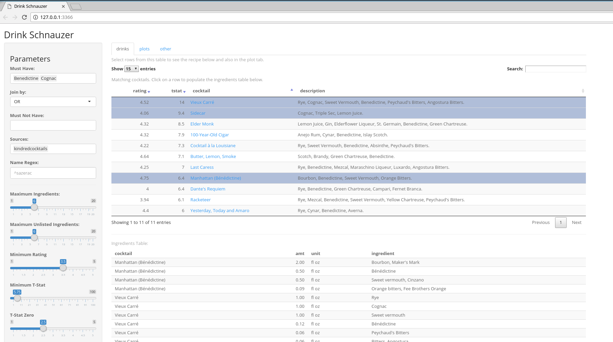
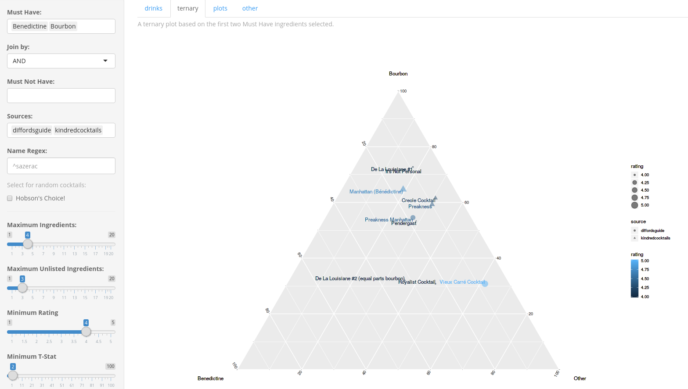
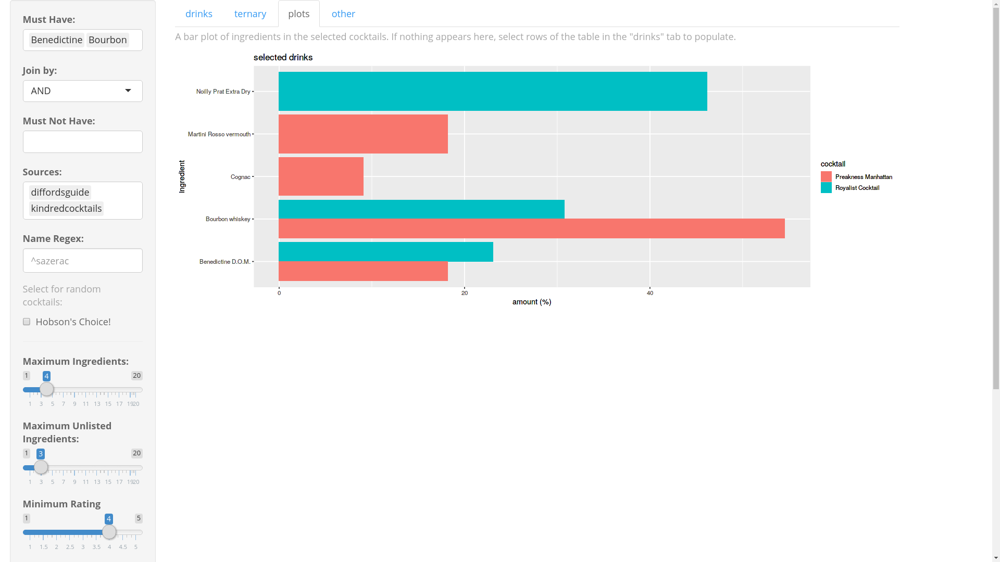

```{r setup,include=FALSE}
#---
#Title: cocktailApp
#Date: Tue Jun 19 2018 07:58:50 AM
#---

# set the knitr options ... for everyone!
# if you unset this, then vignette build bonks. oh, joy.
#opts_knit$set(progress=TRUE)
opts_knit$set(eval.after='fig.cap')
# for a package vignette, you do want to echo.
# opts_chunk$set(echo=FALSE,warning=FALSE,message=FALSE)
opts_chunk$set(warning=FALSE,message=FALSE)
#opts_chunk$set(results="asis")
opts_chunk$set(cache=TRUE,cache.path="cache/")

#opts_chunk$set(fig.path="github_extra/figure/",dev=c("pdf","cairo_ps"))
#opts_chunk$set(fig.path="github_extra/figure/",dev=c("png","pdf"))
#opts_chunk$set(fig.path="github_extra/figure/",dev=c("png"))
opts_chunk$set(fig.path="man/figures/",dev=c("png"))
opts_chunk$set(fig.width=5,fig.height=4,dpi=64)

# doing this means that png files are made of figures;
# the savings is small, and it looks like shit:
#opts_chunk$set(fig.path="figure/",dev=c("png","pdf","cairo_ps"))
#opts_chunk$set(fig.width=4,fig.height=4)
# for figures? this is sweave-specific?
#opts_knit$set(eps=TRUE)

# this would be for figures:
#opts_chunk$set(out.width='.8\\textwidth')
# for text wrapping:
options(width=64,digits=2)
opts_chunk$set(size="small")
opts_chunk$set(tidy=TRUE,tidy.opts=list(width.cutoff=50,keep.blank.line=TRUE))

#cocktailApp.meta <- packageDescription('cocktailApp')
library(cocktailApp)
#[](http://codecov.io/github/shabbychef/cocktailApp?branch=master)
```

# cocktailApp

[](https://travis-ci.org/shabbychef/cocktailApp)
[](http://codecov.io/github/shabbychef/cocktailApp?branch=master)
[](https://cran.r-project.org/package=cocktailApp)
[](http://www.r-pkg.org/pkg/cocktailApp)
[](http://www.r-pkg.org/pkg/cocktailApp)


A Shiny app to discover cocktails.

-- Steven E. Pav, shabbychef@gmail.com

## Installation

This package can be installed from 
[CRAN](https://cran.r-project.org/package=cocktailApp "CRAN page"),
via [drat](https://github.com/eddelbuettel/drat "drat"), or 
from [github](https://www.github.com/shabbychef/cocktailApp "cocktailApp")
via devtools:

```{r install,eval=FALSE,echo=TRUE}
# via CRAN:
install.packages("cocktailApp")
# via drat:
if (require(drat)) {
    drat:::add("shabbychef")
    install.packages("cocktailApp")
}
# get snapshot from github (may be buggy)
if (require(devtools)) {
	# latest greatest
	install_github('shabbychef/cocktailApp',ref='master')
}
```

# Basic Usage

The app can be run in a few ways: 

1. You can download the github repo and run the `app.R` in the main directory,
	 either via `shiny::runApp()` or by moving this directory to a location that
	 Shiny Server serves.
1. You can install the package and then use the `cocktailApp()` function.

## Screenshots





## Data

The underlying data to power the shiny app is also available from this package.
It is called, simply, `cocktails`. This data frame has rows for each
ingredient, with amounts, and units, and is joined to information about the
cocktail, which is identified by name, an upstream ID, URL, rating, number of
votes, and more.


```{r data_basic,cache=FALSE,eval=TRUE,echo=TRUE}
library(cocktailApp)
library(dplyr)
library(knitr)
utils::data('cocktails',package='cocktailApp')
cocktails %>%
	arrange(desc(rating)) %>%
	head(n=10) %>%
	select(cocktail,ingredient,amt,unit,rating) %>%
	knitr::kable()
```


